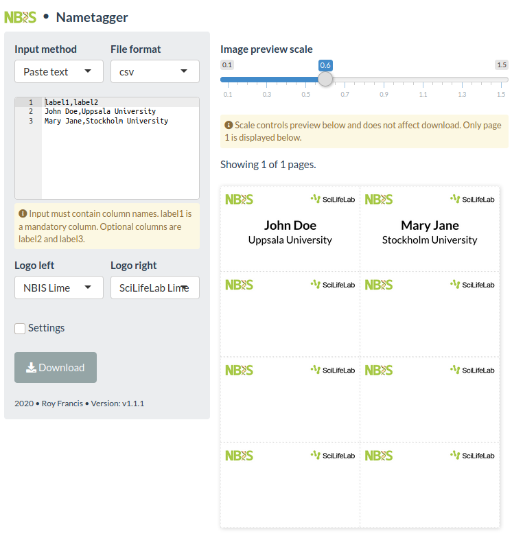

# Nametagger

This is an R shiny app to create labels for clip-on name badges.

This app requires the following R packages: `ggplot2, shiny, shinythemes, aceEditor, showtext`. This is not an R package. Run app using `runApp("app.R")`. Click [here](https://roymf.shinyapps.io/nametagger/) to see a demo of this app. This link may not always be active.

2019 | Roy Francis
