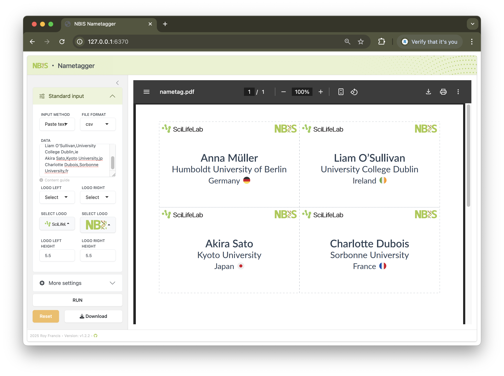

# shiny-nametagger

[](https://github.com/royfrancis/shiny-nametagger/actions?workflow=build) [](https://hub.docker.com/repository/docker/royfrancis/shiny-nametagger)

A web app to create labels for clip-on name badges.



## Running the app

### Run online

Click [here](https://nametagger.serve.scilifelab.se) to access an online instance of this app. This link may not always be active.

### Run in a docker container

```
docker run --platform=linux/amd64 --rm -p 8787:8787 royfrancis/shiny-nametagger:latest
```

The app should be available through a web browser at `http://0.0.0.0:8787`.

### Run in R

Install the following R packages:

```
install.packages(c("shiny","markdown","colourpicker","shinyWidgets","bsicons"))
remotes::install_github("rstudio/bslib")
remotes::install_github("quarto-dev/quarto-r")
```

This repo is not an R package. In the root directory of this repo, run app using `shiny::runApp()`.

---

2025 • Roy Francis
